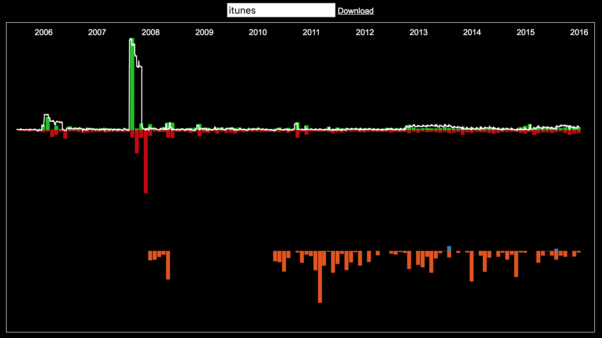

## Bank Account History Review And Search

A timeline of bank account balance, credits and debits, with a very simple transaction search facility.



### Installation

Prerequisites:
 - Bower
 - Your bank history in CSV form (date, desc, cr, dr, balance)
 - A browser ;)

Clone this repo and install Bower packages:

```bash
git clone https://github.com/ewandennis/sp-account-history
cd d3-account-history
bower install
```

Ensure your bank history CSV file is available as `bankhistory.csv`.

Arrange for an HTTP server to access the visualisation (because CORS):

```bash
npm install node-static -g
static -p 8000
```

[Open http://localhost:8000/ in your browser.](http://localhost:8000/)

### Notes

You can use regex in the search field at the top of the page.  If you use alternation (`|`), each alternate expression will be searched separately and results shown in a different colour.

